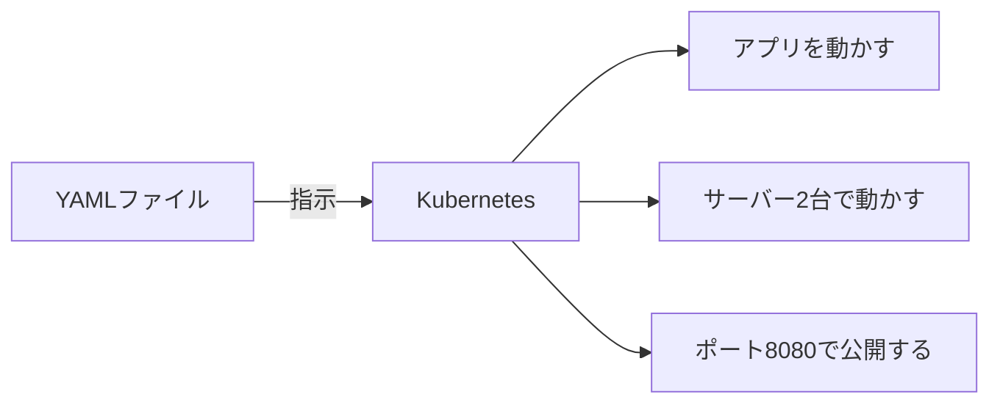
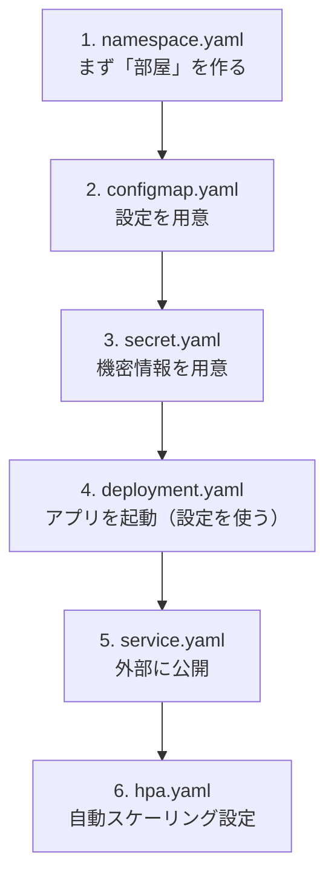
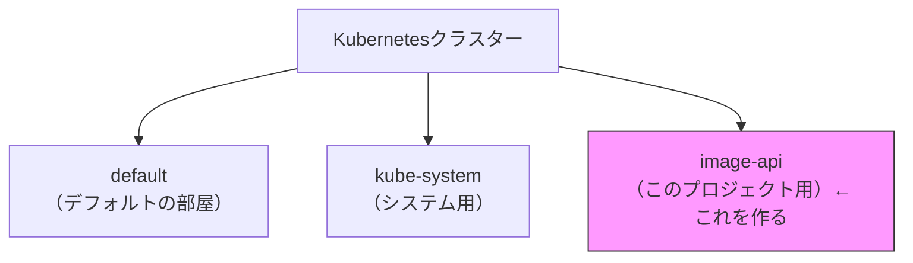
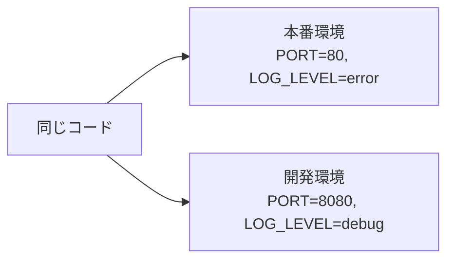
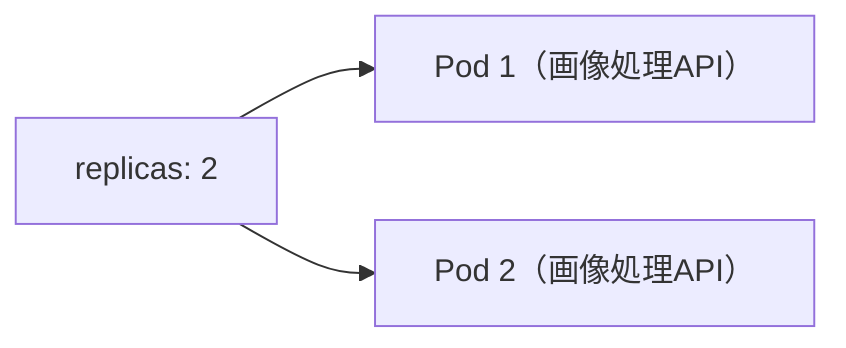
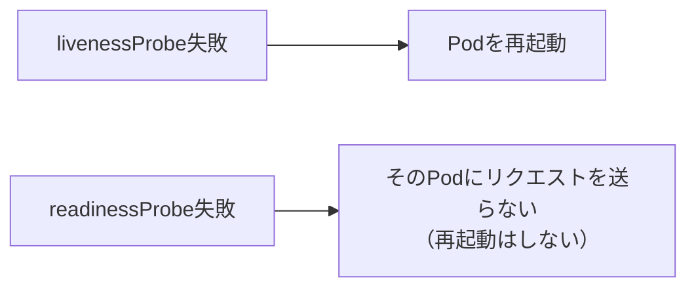
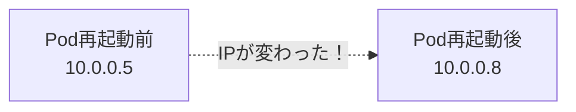
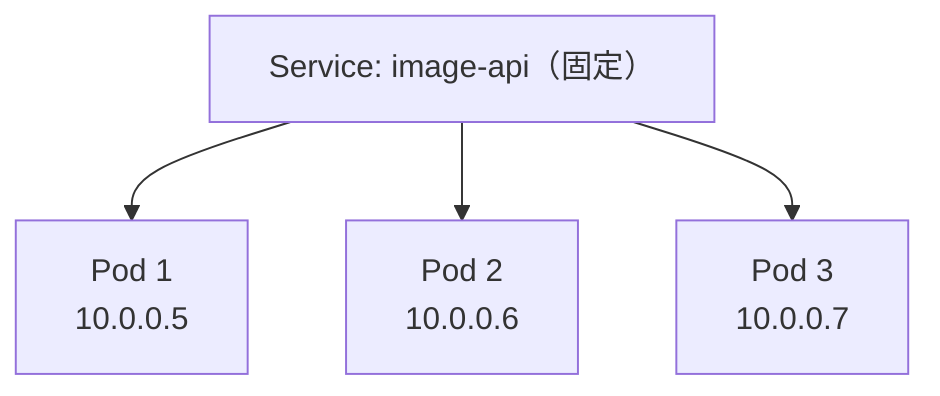
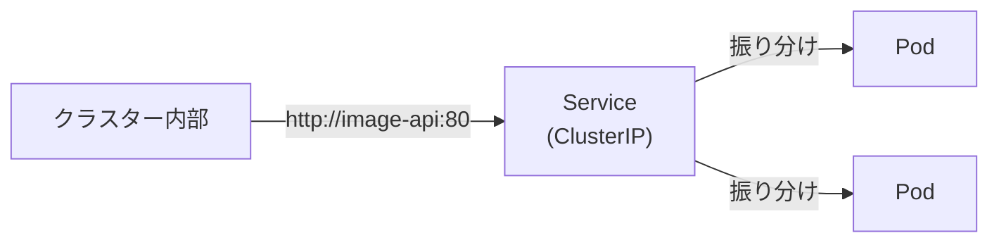
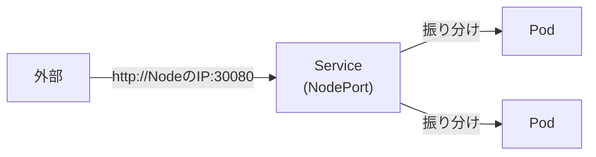

# Kubernetes マニフェスト解説

`k8s/` フォルダにあるYAMLファイルの詳細な説明。

---

## 目次

1. [YAMLファイルとは](#yamlファイルとは)
2. [適用する順番](#適用する順番)
3. [namespace.yaml](#namespaceyaml)
4. [configmap.yaml](#configmapyaml)
5. [secret.yaml](#secretyaml)
6. [deployment.yaml](#deploymentyaml)
7. [service.yaml](#serviceyaml)
8. [hpa.yaml](#hpayaml)

---

## YAMLファイルとは

Kubernetesへの「指示書」。



これをYAML形式で書いたもの。

---

## 適用する順番

依存関係があるので、順番が大事：



コマンド：
```bash
kubectl apply -f k8s/namespace.yaml
kubectl apply -f k8s/configmap.yaml
kubectl apply -f k8s/secret.yaml
kubectl apply -f k8s/deployment.yaml
kubectl apply -f k8s/service.yaml
kubectl apply -f k8s/hpa.yaml
```

または `make k8s-apply` で一括適用。

---

## namespace.yaml

### 役割

「部屋」を作る。リソースをグループ分けするため。

### ファイル内容

```yaml
apiVersion: v1
kind: Namespace
metadata:
  name: image-api        # 部屋の名前
  labels:
    app: image-processing
```

### 行ごとの説明

| 行 | 意味 |
|----|------|
| `apiVersion: v1` | 使うAPIのバージョン |
| `kind: Namespace` | 「これはNamespaceの定義です」 |
| `metadata:` | このリソースの情報 |
| `name: image-api` | Namespaceの名前 |
| `labels:` | タグ付け（検索しやすくするため） |

### なぜ必要？



他のプロジェクトと混ざらないように分ける。

### 確認コマンド

```bash
kubectl get namespaces
```

---

## configmap.yaml

### 役割

設定値を外部ファイルで管理。コードを変えずに設定だけ変更できる。

### ファイル内容

```yaml
apiVersion: v1
kind: ConfigMap
metadata:
  name: image-api-config
  namespace: image-api      # どの部屋に作るか
data:
  PORT: "8080"              # サーバーのポート
  LOG_LEVEL: "info"         # ログレベル
  MAX_IMAGE_SIZE: "10485760"  # 最大画像サイズ（10MB）
```

### 行ごとの説明

| 行 | 意味 |
|----|------|
| `kind: ConfigMap` | 「これは設定ファイルです」 |
| `namespace: image-api` | image-api部屋に作る |
| `data:` | 設定値の一覧 |
| `PORT: "8080"` | 環境変数 PORT=8080 |

### どう使われる？

Deploymentで参照される：

```yaml
envFrom:
  - configMapRef:
      name: image-api-config  # ← これを読み込む
```

アプリからは環境変数として見える：

```go
port := os.Getenv("PORT")  // → "8080"
```

### なぜ必要？

設定をコードから分離できる：



コードは同じ、設定だけ変える。

### 確認コマンド

```bash
kubectl get configmap -n image-api
kubectl describe configmap image-api-config -n image-api
```

---

## secret.yaml

### 役割

パスワードやAPIキーなど、機密情報を管理。

### ファイル内容

```yaml
apiVersion: v1
kind: Secret
metadata:
  name: image-api-secret
  namespace: image-api
type: Opaque
data:
  API_KEY: eW91ci1zZWNyZXQta2V5   # base64エンコード済み
```

### ConfigMapとの違い

| | ConfigMap | Secret |
|--|-----------|--------|
| 用途 | 普通の設定 | 機密情報 |
| 値 | そのまま | base64エンコード |
| 例 | PORT, LOG_LEVEL | パスワード, APIキー |

### base64エンコードとは

```bash
# エンコード（保存するとき）
echo -n "your-secret-key" | base64
# → eW91ci1zZWNyZXQta2V5

# デコード（確認するとき）
echo "eW91ci1zZWNyZXQta2V5" | base64 -d
# → your-secret-key
```

**注意**: base64は暗号化ではない。簡単に戻せる。本番では別の方法（Vault等）を使う。

### 確認コマンド

```bash
kubectl get secret -n image-api

# 値を確認（デコード）
kubectl get secret image-api-secret -n image-api -o jsonpath='{.data.API_KEY}' | base64 -d
```

---

## deployment.yaml

### 役割

アプリ（Pod）をどう動かすか定義。一番重要なファイル。

### ファイル内容（コメント付き）

```yaml
apiVersion: apps/v1
kind: Deployment
metadata:
  name: image-api
  namespace: image-api
  labels:
    app: image-api
spec:
  replicas: 2                    # Podを2つ動かす
  selector:
    matchLabels:
      app: image-api             # このラベルのPodを管理
  template:                      # Podのテンプレート
    metadata:
      labels:
        app: image-api
    spec:
      containers:
        - name: image-api
          image: image-api:latest       # Dockerイメージ
          imagePullPolicy: IfNotPresent # ローカルにあれば使う
          ports:
            - containerPort: 8080       # コンテナのポート
          envFrom:
            - configMapRef:
                name: image-api-config  # ConfigMapを環境変数に
            - secretRef:
                name: image-api-secret  # Secretを環境変数に
          resources:
            requests:                   # 最低限必要なリソース
              memory: "64Mi"
              cpu: "100m"
            limits:                     # 最大使用量
              memory: "256Mi"
              cpu: "500m"
          livenessProbe:               # 生存確認
            httpGet:
              path: /health
              port: 8080
            initialDelaySeconds: 5
            periodSeconds: 10
          readinessProbe:              # 準備完了確認
            httpGet:
              path: /ready
              port: 8080
            initialDelaySeconds: 5
            periodSeconds: 5
```

### 重要な部分を詳しく

#### replicas（レプリカ数）

```yaml
replicas: 2
```

同じPodを何個動かすか。2なら2台のサーバーが起動する。



#### resources（リソース制限）

```yaml
resources:
  requests:          # 「最低これだけ欲しい」
    memory: "64Mi"   # メモリ64MB
    cpu: "100m"      # CPU 0.1コア（1000m = 1コア）
  limits:            # 「これ以上は使わせない」
    memory: "256Mi"
    cpu: "500m"
```

なぜ必要？
- 1つのPodが暴走しても、他に影響しない
- HPAがスケーリング判断に使う（詳しくは [orchestration-and-hpa.md](orchestration-and-hpa.md)）

#### livenessProbe（生存確認）

```yaml
livenessProbe:
  httpGet:
    path: /health
    port: 8080
  initialDelaySeconds: 5   # 起動後5秒待ってから確認開始
  periodSeconds: 10        # 10秒ごとに確認
```

「アプリが生きてるか」を確認。失敗したらPodを再起動する。

#### readinessProbe（準備完了確認）

```yaml
readinessProbe:
  httpGet:
    path: /ready
    port: 8080
```

「リクエストを受け付けられるか」を確認。失敗したらトラフィックを送らない。



### 確認コマンド

```bash
kubectl get deployment -n image-api
kubectl describe deployment image-api -n image-api

# Podの状態
kubectl get pods -n image-api
```

---

## service.yaml

### 役割

Podへのアクセス方法を定義。ロードバランサーの役割。

### なぜ必要？

Podは起動するたびにIPアドレスが変わる：



Serviceは固定のアドレスを提供する：



### ファイル内容

2つのServiceを定義している：

#### ClusterIP（クラスター内部用）

```yaml
apiVersion: v1
kind: Service
metadata:
  name: image-api
  namespace: image-api
spec:
  type: ClusterIP           # クラスター内部からのみアクセス可能
  selector:
    app: image-api          # このラベルのPodに転送
  ports:
    - port: 80              # Serviceのポート
      targetPort: 8080      # Podのポート
```



#### NodePort（外部公開用）

```yaml
apiVersion: v1
kind: Service
metadata:
  name: image-api-nodeport
spec:
  type: NodePort
  selector:
    app: image-api
  ports:
    - port: 80
      targetPort: 8080
      nodePort: 30080       # Nodeの30080ポートで公開
```



### Serviceの種類

| 種類 | 用途 | アクセス元 |
|------|------|-----------|
| ClusterIP | 内部通信 | クラスター内のみ |
| NodePort | 開発/テスト | 外部からNodeのポートで |
| LoadBalancer | 本番 | クラウドのロードバランサー経由 |

### 確認コマンド

```bash
kubectl get service -n image-api

# ポートフォワード（ローカルからアクセス）
kubectl port-forward service/image-api 8080:80 -n image-api
```

---

## hpa.yaml

負荷に応じてPod数を自動調整する設定。

HPAの仕組み（オーケストレーションとの違い、metrics-serverが必要な理由など）は
**[orchestration-and-hpa.md](orchestration-and-hpa.md)** に詳しくまとめている。

設定内容と確認コマンドもそちらを参照。

---

## まとめ

| ファイル | 役割 | 一言で |
|---------|------|--------|
| namespace.yaml | 部屋を作る | リソースのグループ分け |
| configmap.yaml | 設定を外部化 | PORT, LOG_LEVELなど |
| secret.yaml | 機密情報を管理 | パスワード, APIキー |
| deployment.yaml | アプリを動かす | Pod数、リソース、ヘルスチェック |
| service.yaml | 外部に公開 | ロードバランサー |
| hpa.yaml | 自動スケーリング | 負荷に応じてPod増減 |
