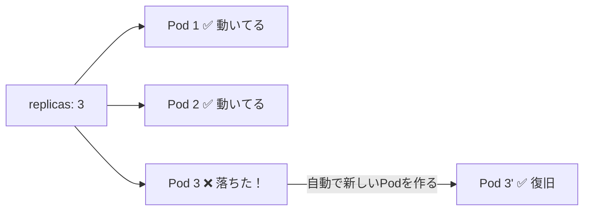
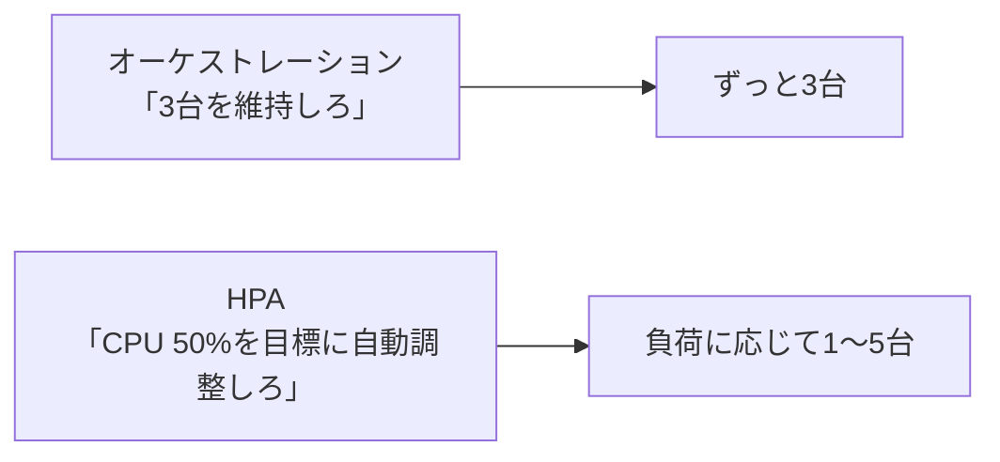
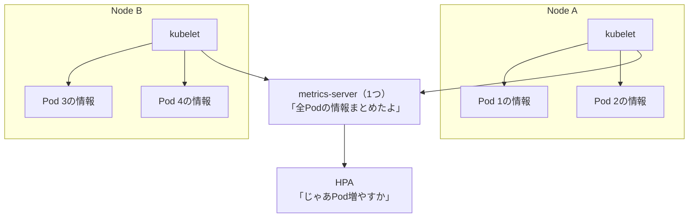
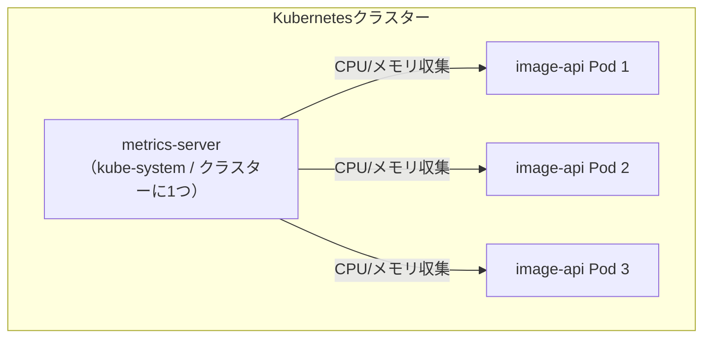
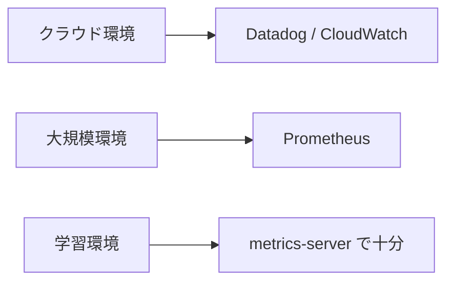
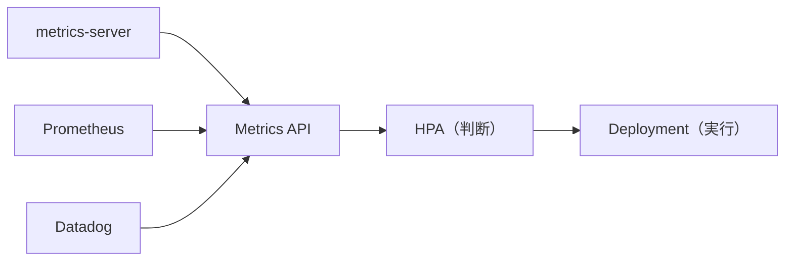
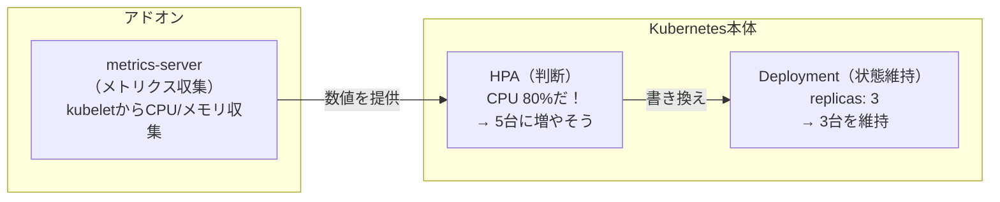
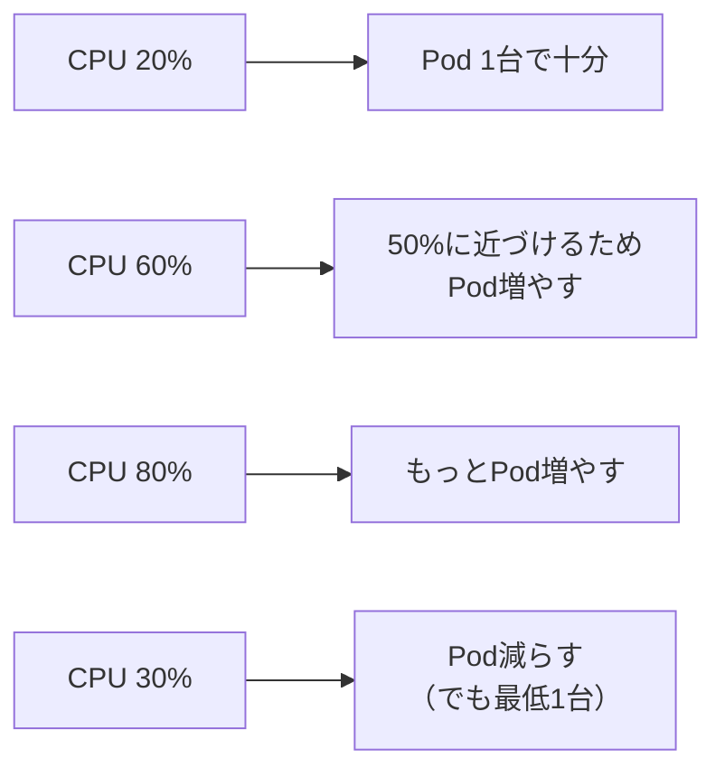
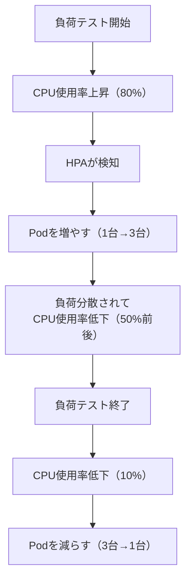

# オーケストレーションと自動スケーリング (HPA)

Kubernetesの「オーケストレーション（状態維持）」と「HPA（自動スケーリング）」は別の仕組み。
この2つの違いと関係を整理する。

---

## 目次

1. [オーケストレーション = 宣言した状態を維持する](#オーケストレーション--宣言した状態を維持する)
2. [HPA = メトリクスに基づいて自動で増減する](#hpa--メトリクスに基づいて自動で増減する)
3. [metrics-serverとは](#metrics-serverとは)
4. [なぜメトリクスはKubernetes本体に含まれないのか](#なぜメトリクスはkubernetes本体に含まれないのか)
5. [全体の関係図](#全体の関係図)
6. [hpa.yamlの設定内容](#hpayamlの設定内容)
7. [スケーリングの流れ](#スケーリングの流れ)
8. [確認コマンド](#確認コマンド)

---

## オーケストレーション = 宣言した状態を維持する

Kubernetesのコア機能は**「宣言した状態を維持すること」**。

```yaml
# deployment.yaml
spec:
  replicas: 3  # ← 「Podを3つ動かしてね」という宣言
```

この場合、Kubernetesは**常にPodを3つ維持する**。メトリクスは不要。

### オーケストレーションがやること

| 状況 | Kubernetesの動作 |
|------|----------------|
| Podが1つ落ちた | 自動で1つ作って3に戻す（自己修復） |
| 負荷が高い | **何もしない**（3のまま） |
| 負荷がゼロ | **何もしない**（3のまま） |



### 手動スケーリング

Pod数を変えたければ手動でコマンドを打つ：

```bash
# 5台に増やす
kubectl scale deployment image-api --replicas=5 -n image-api

# 1台に減らす
kubectl scale deployment image-api --replicas=1 -n image-api
```

これがオーケストレーションの範囲。**「何台にするか」は人間が決める。**

---

## HPA = メトリクスに基づいて自動で増減する

HPA（Horizontal Pod Autoscaler）は、CPU使用率などのメトリクスを見て**「何台にするか」を自動で判断する仕組み**。



### オーケストレーションとHPAの違い

| | オーケストレーション | HPA |
|--|-------------------|-----|
| Pod数の決め方 | 人間が `replicas` に書く | メトリクスから自動計算 |
| メトリクスが必要？ | 不要 | **必要** |
| 負荷が増えたら | 何もしない | Podを増やす |
| 負荷が減ったら | 何もしない | Podを減らす |
| Kubernetes本体の機能？ | はい | はい（ただしメトリクス収集は別） |

HPAは「replicas の値を自動で書き換えてくれるコントローラー」と思えばいい。
書き換えた後の「その台数を維持する」部分はオーケストレーションが担当する。

---

## metrics-serverとは

metrics-serverは、kubeletからCPU/メモリの使用量を収集し、Metrics APIとして公開するコンポーネント。

- Kubernetes公式プロジェクトが提供する**アドオン**（本体とは別にインストールする拡張機能）
- Kubernetes本体には**含まれていない**（別途インストールが必要）
- HPAや `kubectl top` コマンドがこのAPIを使う

### クラスター全体で1つ

metrics-serverはPodごとに1つ付くわけではなく、**クラスター全体に対して1つ**だけ動く。

各Nodeにいる**kubelet**（Podを管理するエージェント）がリソース情報を持っていて、
metrics-serverがそれをまとめて集める仕組み。



このプロジェクトの場合：



```bash
# metrics-serverのPodを確認
kubectl get pods -n kube-system | grep metrics
```

### インストール方法

```bash
# minikubeの場合
minikube addons enable metrics-server

# それ以外の環境
kubectl apply -f https://github.com/kubernetes-sigs/metrics-server/releases/latest/download/components.yaml

# 確認（1-2分待つ）
kubectl top pods -n image-api
```

---

## なぜメトリクスはKubernetes本体に含まれないのか

直感的には「スケーリングするならメトリクスは必須では？」と思う。
しかしKubernetesの設計思想は**「コア機能は最小限にして、残りはプラグインで」**。

### 理由1: オーケストレーションにメトリクスは不要

Kubernetes本体が担うのは「宣言された状態を維持する」こと。

- `replicas: 3` と書いてあれば3台維持する
- Podが落ちたら再作成する

これにメトリクスは必要ない。メトリクスが必要になるのはHPA（自動スケーリング）を使うときだけ。

### 理由2: メトリクスの収集方法は環境によって違う



metrics-serverを本体に組み込むと「使わないのに動いてる」「別のに差し替えたい」ときに困る。

### 理由3: インターフェースと実装の分離

Kubernetesは **Metrics API（インターフェース）だけ定義** して、実装は差し替え可能にしている。



Linuxカーネルがファイルシステムの仕組みは提供するけど、ext4/xfs/btrfsは別モジュール、というのに近い。

---

## 全体の関係図



metrics-serverがないと:
- HPAは判断材料がない → 自動スケーリングできない
- Deploymentは問題なく動く → replicas固定で維持

---

## hpa.yamlの設定内容

```yaml
apiVersion: autoscaling/v2
kind: HorizontalPodAutoscaler
metadata:
  name: image-api-hpa
  namespace: image-api
spec:
  scaleTargetRef:
    apiVersion: apps/v1
    kind: Deployment
    name: image-api          # このDeploymentを対象に
  minReplicas: 1             # 最小Pod数
  maxReplicas: 5             # 最大Pod数
  metrics:
    - type: Resource
      resource:
        name: cpu
        target:
          type: Utilization
          averageUtilization: 50   # CPU使用率50%を目標
```

### 設定値の意味

| 設定 | 意味 |
|------|------|
| `scaleTargetRef` | どのDeploymentを対象にするか |
| `minReplicas: 1` | 最低1台は動かす |
| `maxReplicas: 5` | 最大5台まで増やす |
| `averageUtilization: 50` | 平均CPU使用率を50%に保つよう調整 |

### CPU使用率とPod数の関係



---

## スケーリングの流れ



---

## 確認コマンド

```bash
# HPA の状態を確認
kubectl get hpa -n image-api

# リアルタイム監視
watch kubectl get hpa,pods -n image-api

# Pod のリソース使用量を確認（metrics-server必要）
kubectl top pods -n image-api
```
